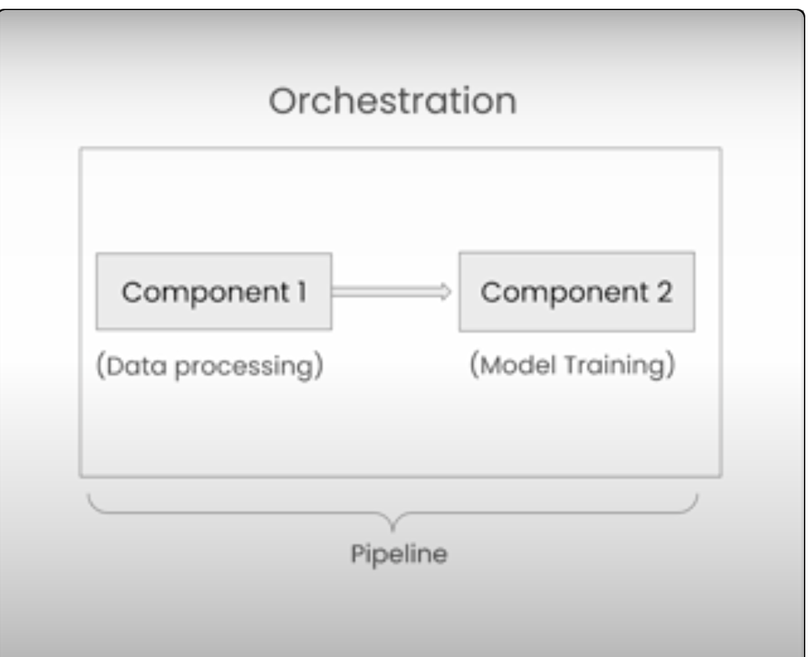
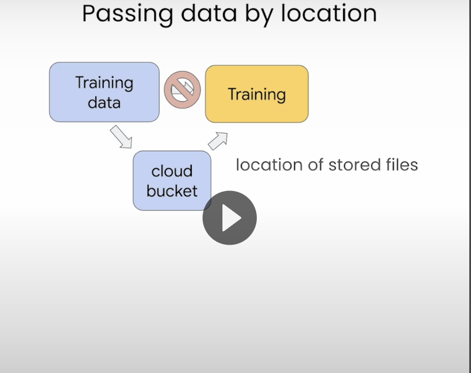
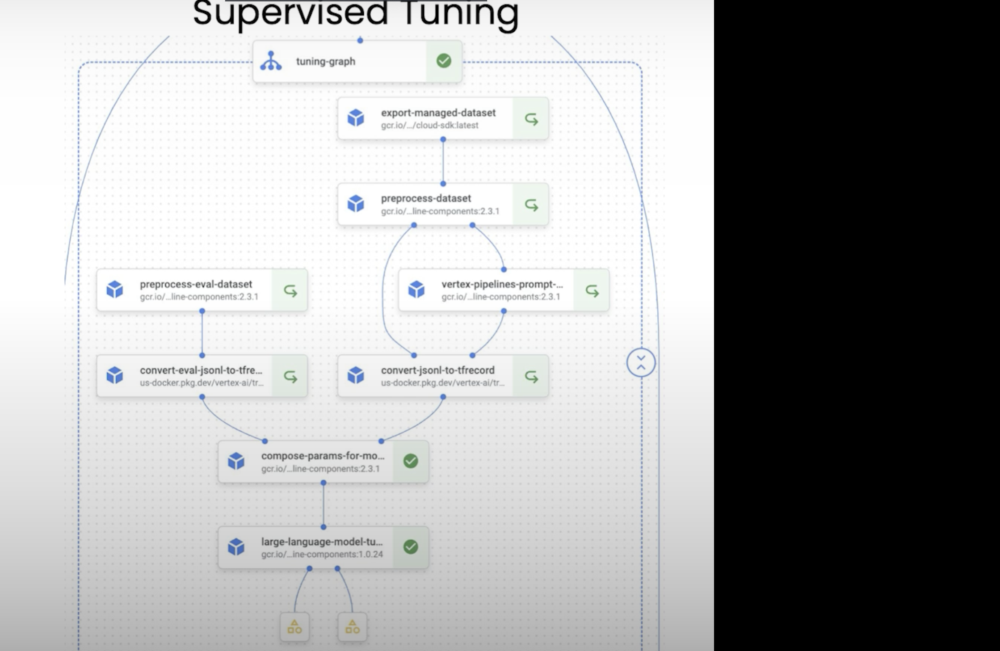

## LLMOps Workflow with Google
   * Finish this workflow. 
   * 

## MLOps workflow for LLMs
   * Different tools: Apache Airflow or Kubeflow
   * Kubeflow pipeline will be used.

##  How are the pipeline?
    It consists of processes called components which are sequentially attached to one another.

## Building and Managing Pipeline:
   Most of the pipelines similar to terraform speak: Domain Specigic Language.
   similar to Terraform: HCL

   Usually its an acyclic graph. 

   Simple convert a function to decorator with the code and dependencies and 
   Operating System.

   How to pass the data from 1 component to the other? 
   Usually we could pass the path of the files where they are stored from memory but we will suffer from memory constraints in the future.

   The best way is to pass the path to the cloud url or https address because of robustness and scalability as shown below.

   Kubeflow is easier since you can just add a decorator at the top of the function defining the component and get the it as a Kubeflow Component

   Then you have 1 main function that calls all the individual pipeline components sequentially added.

   For the pipeline its @dsl.pipeline, then 
   compile everything with: compiler.Compiler().compile(pipeline_function, "output.yaml") where the configs will be stored.

   pipeline_arguments = {
      "recipient":"World!",
   }

   !cat pipeline.yaml

   from google.cloud.aiplatform import PipelineJob

   Vertex AI is built on top of Kubertes on Google Cloud.

   job = PipelineJob(
      template_path="output.yaml",
      display_name=f"deep_learning_ai_pipeline",
      parameter_values=pipeline_arguments,
      location="us-central",
      pipeline_root="./",
   )

   job.submit()

   #TODO: execute on google Vertex AI pipeline.

## Sample Example of Full ML Training Life Cycle of a Given LLM Finetuning 
   * probably via RLHF.

## Caching and pre-caching.
   There is also the option to cache the pipeline.
   Meaning if no changes were made, the pipeline wont be
   recompiled unless new changes are made.

## Predictions, Promots and Safety
   * This is where we use Nvidia Guardrail
   * A better one is to use: Giskard (for testing llm)

## Conclusion:
   Kubeflow as a framework for LLMOPS and acyclic graph generation and deployment.

## Techniques to send multiple prompts.
   There are techniques to send multiple prompts to get
   multiple answers.

## Package, Deploy and versioning models
   * Operation metrics: how does llm perform?
   * Safety: Bias
   * Inference scalabitliy:
      load test (needs to be done)
      controlled roll out, etc...

   * latency: permissible latency.
     Is 2s ok for the users?
     Smaller models
     Faster processors (GPUs,TPUs)
     Deploy regionally. (CDN)

## Format prompt in production:
   Data and instructions need to be the same for production as it was during training.

   Example: usage of jinja template or as follows: 

   Also LLM can generate things like hallucination, uncorrect, biased (gender or politics), no toxicity.

## Conclusion:
   * LLMOps Conclusion 
     Really really nice to work with Kubeflow. 

   * 
