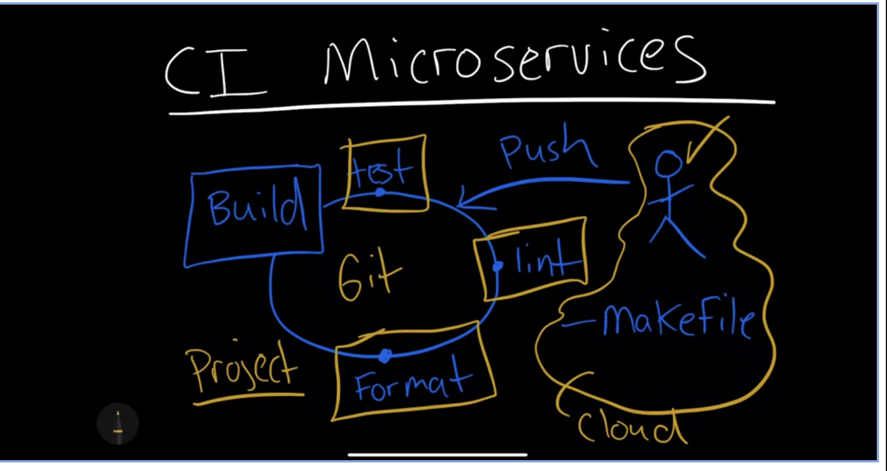

## LLMOps:
   * Oprationalize Microservices: 
   cloud watch, grafana

## Explanation 

## IaC
    * Infrastructure as a Code: example: Terraform

    * AWS also has it own CI/CD:
      * AWS CodeBuild
      * AWS Code Deploy
      * AWs Code Pipeline 

##  Reference to build: https://github.com/noahgift/continuous-integration

     * Complete this tutorial

## Rust Compiler: prevents common mistakes.
   * 